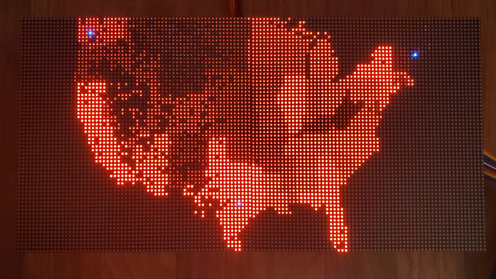

## About

This US map will be a 3D printed topological projection of the entire United States. Use a grid of LEDs in series which will be programmed to light up in specific locations in accordance with the data from the Health Language Processing Lab.

## Map Viewer

Displays US cities using LED matrix coordinates of three cities as reference. Reference cities are displayed in red, all others are displayed in blue.

### Building

The map viewer requires the [Eigen library](http://eigen.tuxfamily.org/index.php?title=Main_Page) for matrix transformations. To "install" Eigen, download and extract its source code to any directory. Here I'm using the Downloads directory.

```
cd ~/Downloads

wget https://gitlab.com/libeigen/eigen/-/archive/3.3.7/eigen-3.3.7.tar.bz2

tar -xf eigen-3.3.7.tar.bz2
```

After extracting you should see a directory named `eigen-3.3.7` or similar. When you run `make`, use the directory's path for the `EIGEN` variable.

```
make map-viewer EIGEN="~Downloads/eigen-3.3.7/"
```

### Usage

```
Usage: sudo ./map-viewer [options]
    Display US cities using LED matrix coordinates of three cities as reference.

Options:
    -r <string>        : Comma-separated reference string with format,
                         "<city1>,<state1>,<x1>,<y1>,<city2>,<state2>,<x2>,<y2>,<city3>,<state3>,<x3>,<y3>"
    --led-cols         : Number of columns in one panel (default=32).
    --led-rows         : Number of rows in one panel (default=32).
    --led-chain        : Number of daisy-chained panels (default=1).
    --led-parallel     : Number of parallel chains (range=1..3, default=1).
```

### Notes

Currently the `-r` option does not have a default value, so it is required. The LED matrix coordinates should follow standard display coordinates such that the top left pixel is the origin.


### Demo

```
sudo ./map-viewer --led-cols 64 --led-rows 64 --led-chain 2 -r "Seattle,WA,10,10,El Paso,TX,60,50,Portland,ME,110,10"
```




## Panel Test

Cycles colors and displays column and row numbers on panels.

### Building

```
make panel-test
```

### Usage

```
sudo ./panel-test [options]

Options:
    --led-cols         : Number of columns in one panel (default=32).
    --led-rows         : Number of rows in one panel (default=32).
    --led-chain        : Number of daisy-chained panels (default=1).
    --led-parallel     : Number of parallel chains (range=1..3, default=1).
    --led-pixel-mapper : Semicolon-separated list of pixel-mappers to arrange pixels. 
                         Available: "Rotate:<degrees>" 
```

### Demo


## Acknowledgements

* [Henner Zeller](https://github.com/hzeller/rpi-rgb-led-matrix) - Raspberry Pi LED Matrix library
* [SimpleMaps](https://simplemaps.com/data/us-cities) - US cities database
* [The COVID Tracking Project](https://covidtracking.com/data/download) - COVID-19 state data